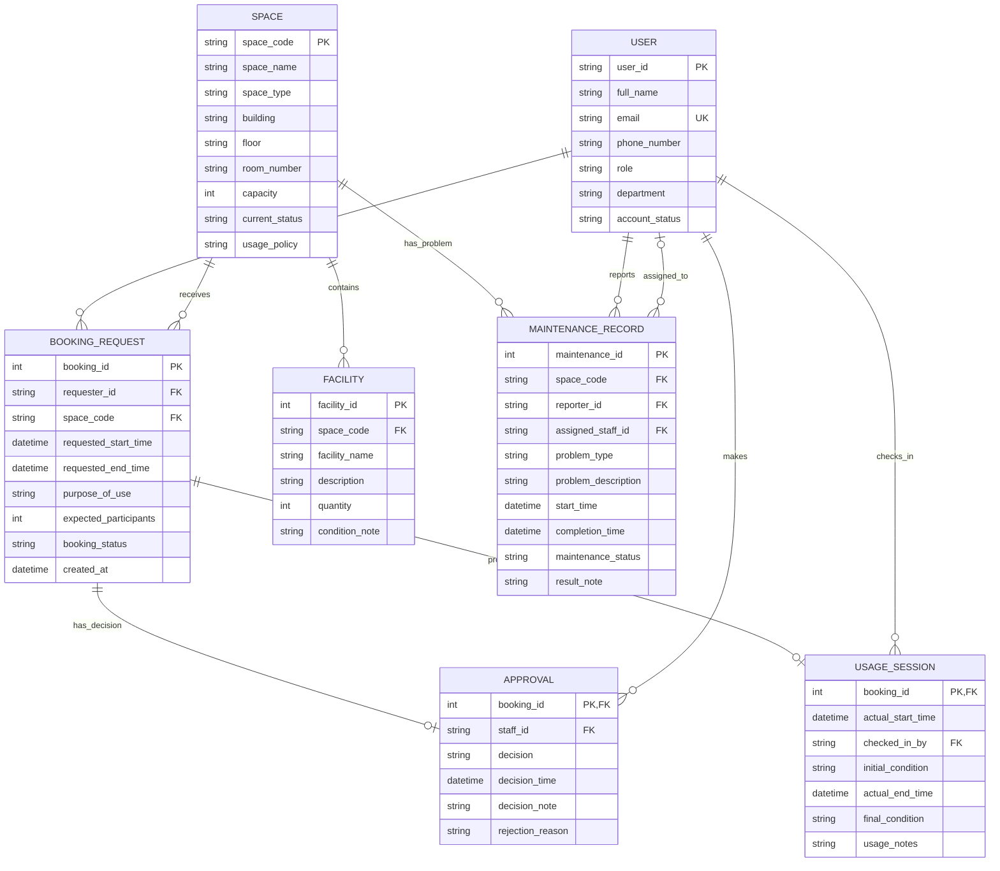

# Task 2: Conceptual Database Design - ERD

## 1. Design Overview

This conceptual database design represents the Campus Space Management System described in the business requirements and Task 1 analysis. The ERD focuses on the main entities needed to manage university users, campus spaces, available facilities, booking requests, approvals, usage sessions, and maintenance records.

The design uses one general `USER` entity for all account holders. Specific responsibilities are controlled by the `role` attribute, allowing students, lecturers, teaching assistants, facility staff, department administrators, and facility managers to be stored consistently while still enforcing business rules based on role.

## 2. Entity-Relationship Diagram

## 3. Entity Descriptions

### 3.1 USER

Stores every person with a university account who interacts with the system.

Key attributes:

| Attribute | Type / Domain | Key Role | Description |
|---|---|---|---|
| user_id | Identifier | Primary key | Unique identifier for each university account holder. |
| full_name | Text | Non-key | User's full name. |
| email | Text | Candidate key | Unique university email address. |
| phone_number | Text | Non-key | Contact number. |
| role | Controlled text | Non-key | student, lecturer, teaching assistant, facility staff, department administrator, or facility manager. |
| department | Text | Non-key | User's department. |
| account_status | Controlled text | Non-key | Indicates whether the account is active or otherwise allowed to use the system. |

### 3.2 SPACE

Stores physical shared spaces managed by the School.

Key attributes:

| Attribute | Type / Domain | Key Role | Description |
|---|---|---|---|
| space_code | Identifier | Primary key | Unique code for the space. |
| space_name | Text | Non-key | Name of the space. |
| space_type | Controlled text | Non-key | auditorium, classroom, computer laboratory, project laboratory, meeting room, or student workspace. |
| building | Text | Candidate key component | Building where the space is located. |
| floor | Text | Candidate key component | Floor where the space is located. |
| room_number | Text | Candidate key component | Room number of the space. |
| capacity | Integer | Non-key | Maximum number of participants. |
| current_status | Controlled text | Non-key | available, in use, under maintenance, temporarily closed, or retired. |
| usage_policy | Text | Non-key | Policy or usage notes for the space. |

Candidate key: `building + floor + room_number`.

### 3.3 FACILITY

Stores facility or equipment items available in specific spaces.

Key attributes:

| Attribute | Type / Domain | Key Role | Description |
|---|---|---|---|
| facility_id | Identifier | Primary key | Unique identifier for each facility item. |
| space_code | Identifier | Foreign key | References the space containing the facility. |
| facility_name | Text | Non-key | Facility name such as projector, whiteboard, microphone, computer, or air conditioner. |
| description | Text | Non-key | Optional facility description. |
| quantity | Integer | Non-key | Number of facility items in the space. |
| condition_note | Text | Non-key | Optional condition note for the facility in that space. |

### 3.4 BOOKING_REQUEST

Stores requests made by users to reserve a space for a specific period and purpose.

Key attributes:

| Attribute | Type / Domain | Key Role | Description |
|---|---|---|---|
| booking_id | Identifier | Primary key | Unique booking request identifier. |
| requester_id | Identifier | Foreign key | References the user who submitted the request. |
| space_code | Identifier | Foreign key | References the requested space. |
| requested_start_time | Date/time | Non-key | Requested start time. |
| requested_end_time | Date/time | Non-key | Requested end time. |
| purpose_of_use | Controlled text | Non-key | lecture, examination, seminar, workshop, meeting, student activity, or administrative event. |
| expected_participants | Integer | Non-key | Expected number of participants. |
| booking_status | Controlled text | Non-key | pending, approved, rejected, cancelled, checked in, completed, or no-show. |
| created_at | Date/time | Non-key | Time the booking request was created. |

### 3.5 APPROVAL

Stores approval or rejection decisions made by facility staff or facility managers.

Key attributes:

| Attribute | Type / Domain | Key Role | Description |
|---|---|---|---|
| booking_id | Identifier | Primary key, foreign key | References the booking request being decided; uniquely identifies the approval. |
| staff_id | Identifier | Foreign key | References the facility staff member or facility manager making the decision. |
| decision | Controlled text | Non-key | approved or rejected. |
| decision_time | Date/time | Non-key | Time of approval or rejection. |
| decision_note | Text | Non-key | Optional note about the decision. |
| rejection_reason | Text | Non-key | Required when the decision is rejected. |

### 3.6 USAGE_SESSION

Stores the actual check-in and completion details for an approved booking.

Key attributes:

| Attribute | Type / Domain | Key Role | Description |
|---|---|---|---|
| booking_id | Identifier | Primary key, foreign key | References the booking used for the session; uniquely identifies the usage session. |
| actual_start_time | Date/time | Non-key | Actual check-in/start time. |
| checked_in_by | Identifier | Foreign key | References the user who performed check-in. |
| initial_condition | Text | Non-key | Condition of the space at check-in. |
| actual_end_time | Date/time | Non-key | Actual completion/end time. |
| final_condition | Text | Non-key | Condition of the space at completion. |
| usage_notes | Text | Non-key | Notes recorded after usage. |

### 3.7 MAINTENANCE_RECORD

Stores reported space problems, assignment details, progress, and results.

Key attributes:

| Attribute | Type / Domain | Key Role | Description |
|---|---|---|---|
| maintenance_id | Identifier | Primary key | Unique maintenance record identifier. |
| space_code | Identifier | Foreign key | References the space with the problem. |
| reporter_id | Identifier | Foreign key | References the user who reported the problem. |
| assigned_staff_id | Identifier | Foreign key | References the staff member assigned to handle the problem. |
| problem_type | Controlled text | Non-key | broken projector, air-conditioning failure, damaged furniture, cleaning issue, network problem, or similar category. |
| problem_description | Text | Non-key | Detailed problem description. |
| start_time | Date/time | Non-key | Time the maintenance record was opened or started. |
| completion_time | Date/time | Non-key | Time the issue was completed, if completed. |
| maintenance_status | Controlled text | Non-key | Current state of the maintenance issue. |
| result_note | Text | Non-key | Resolution or result note. |

## 4. Relationship Details and Cardinalities

| Relationship | Cardinality | Minimum Participation | Maximum Participation | Meaning |
|---|---|---|---|---|
| USER submits BOOKING_REQUEST | USER 0..N, BOOKING_REQUEST 1..1 | BOOKING_REQUEST is mandatory; USER is optional | One user can submit many bookings; each booking has exactly one requester | A request cannot exist without a requester. |
| SPACE receives BOOKING_REQUEST | SPACE 0..N, BOOKING_REQUEST 1..1 | BOOKING_REQUEST is mandatory; SPACE is optional | One space can receive many bookings over time; each booking is for one space | A request cannot exist without a selected space. |
| SPACE contains FACILITY | SPACE 0..N, FACILITY 1..1 | FACILITY is mandatory; SPACE is optional | One space can have many facilities; each facility belongs to exactly one space | A space may have no facilities recorded. |
| BOOKING_REQUEST has APPROVAL | BOOKING_REQUEST 0..1, APPROVAL 1..1 | APPROVAL is mandatory; BOOKING_REQUEST is optional | A pending booking may have no approval; each approval belongs to one booking | A booking can have at most one approval record. |
| USER makes APPROVAL | USER 0..N, APPROVAL 1..1 | APPROVAL is mandatory; USER is optional | One authorized staff user can make many approval decisions; each decision has one staff member | Staff role must be facility staff or facility manager. |
| BOOKING_REQUEST produces USAGE_SESSION | BOOKING_REQUEST 0..1, USAGE_SESSION 1..1 | USAGE_SESSION is mandatory; BOOKING_REQUEST is optional | A booking can produce at most one usage session; each session belongs to one booking | Rejected, cancelled, or no-show bookings may have no session. |
| USER checks in USAGE_SESSION | USER 0..N, USAGE_SESSION 1..1 | USAGE_SESSION is mandatory; USER is optional | One user can check in many sessions; each session records one check-in user | The check-in user may be requester or staff depending on policy. |
| SPACE has MAINTENANCE_RECORD | SPACE 0..N, MAINTENANCE_RECORD 1..1 | MAINTENANCE_RECORD is mandatory; SPACE is optional | One space can have many maintenance records; each record concerns one space | A maintenance issue cannot exist without a related space. |
| USER reports MAINTENANCE_RECORD | USER 0..N, MAINTENANCE_RECORD 1..1 | MAINTENANCE_RECORD is mandatory; USER is optional | One user can report many problems; each maintenance record has one reporter | Any valid account holder may report a problem. |
| USER assigned_to MAINTENANCE_RECORD | USER 0..N, MAINTENANCE_RECORD 0..1 | Both sides are optional for assignment | One staff user can be assigned many maintenance records; a record may be unassigned initially | Assigned user should be facility staff or facility manager. |

## 5. Participation Constraints

| Entity | Participation Constraint | Explanation |
|---|---|---|
| USER in BOOKING_REQUEST | Partial | A user may exist without submitting any booking. |
| BOOKING_REQUEST in USER | Total | Every booking request must have exactly one requester. |
| SPACE in BOOKING_REQUEST | Partial | A space may exist without any booking requests. |
| BOOKING_REQUEST in SPACE | Total | Every booking request must be for exactly one space. |
| FACILITY in SPACE | Total | Every facility must reference exactly one space. |
| BOOKING_REQUEST in APPROVAL | Partial | A booking may remain pending with no approval record yet. |
| APPROVAL in BOOKING_REQUEST and USER | Total | Every approval must refer to one booking and one approving staff user. |
| BOOKING_REQUEST in USAGE_SESSION | Partial | A booking may never produce a usage session if rejected, cancelled, or no-show. |
| USAGE_SESSION in BOOKING_REQUEST and USER | Total | Every usage session must belong to one booking and record one check-in user. |
| SPACE in MAINTENANCE_RECORD | Partial | A space may have no maintenance records. |
| MAINTENANCE_RECORD in SPACE and reporter USER | Total | Every maintenance record must reference one space and one reporter. |
| MAINTENANCE_RECORD in assigned USER | Partial | A maintenance issue may be created before staff assignment. |

## 6. Conceptual Business Constraints Reflected in the ERD

1. Users are represented as a single entity with role-based behavior.
2. A booking request must always connect one user to one space for a requested time period.
3. A space can have many booking requests over time, but approved bookings for the same space must not overlap.
4. Spaces with status `under maintenance`, `temporarily closed`, or `retired` are not bookable.
5. Approvals are separate from booking requests so that staff member, decision time, decision note, and rejection reason are recorded.
6. Only users with role `facility staff` or `facility manager` may appear as approval staff.
7. Usage sessions are separate from booking requests because requested times may differ from actual start and end times.
8. A booking request can have at most one usage session.
9. Each facility belongs to exactly one space; a space may have multiple facilities.
10. Maintenance records connect a space, a reporter, and optionally an assigned staff member to support incident reporting and resolution.

## 7. Notes for Logical Design

The conceptual design will be converted into the relational schema in Task 3. The expected relational mapping is:

| Conceptual Entity | Expected Relation |
|---|---|
| USER | `users` |
| SPACE | `spaces` |
| FACILITY | `facilities` |
| BOOKING_REQUEST | `booking_requests` |
| APPROVAL | `approvals` |
| USAGE_SESSION | `usage_sessions` |
| MAINTENANCE_RECORD | `maintenance_records` |

Each facility belongs to exactly one space via a foreign key on `facilities.space_code`. The one-to-zero-or-one relationship between `BOOKING_REQUEST` and `USAGE_SESSION` is enforced by `usage_sessions.booking_id` as the primary key.
